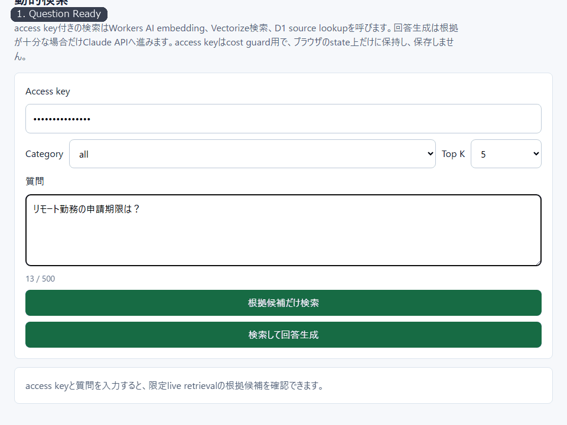
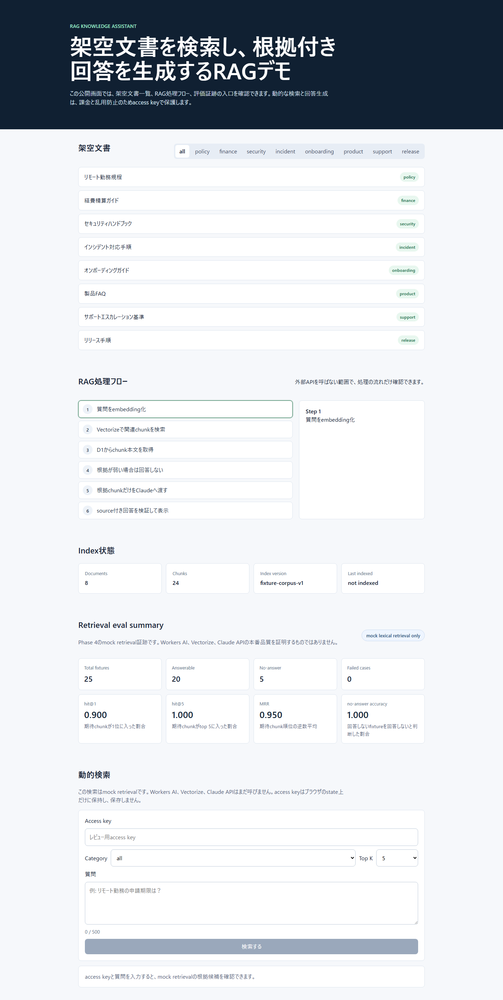
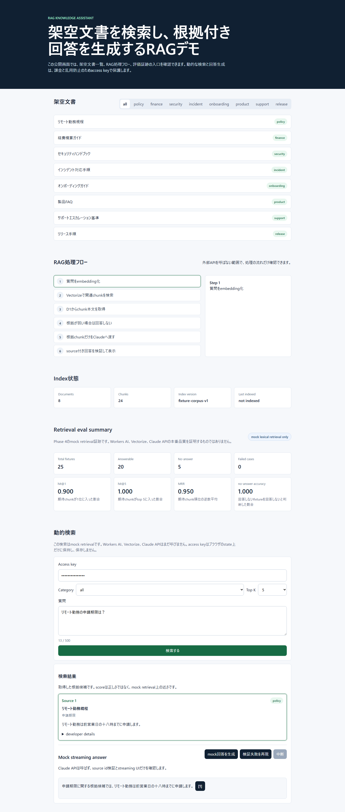

# RAG Knowledge Assistant


架空文書コーパスを使ったRAGポートフォリオです。React / TypeScript / Hono / Cloudflare Workers上で、検索、根拠カード、no-answer制御、SSEによる回答ストリーミング、post-generation source id validation、検証証跡の出し方を確認できます。

公開デモは **未認証トップページ + access key付き限定live RAG demo** として構成しています。未認証で見えるトップページでは概要、架空文書、RAGフロー、評価サマリーを確認できます。access key付きの `/api/search` と `/api/ask` では Workers AI、Vectorize、D1、Anthropic を呼びます。これはportfolio用のcost guardであり、production authenticationではありません。

## Demo

- **Live demo**: https://rag-knowledge-assistant.atlas-lab.workers.dev
- **Source**: https://github.com/proto-atlas/rag-knowledge-assistant

## 確認導線

- **30 秒で見る**: Public demo でトップページ、架空文書、RAGフロー、評価サマリーをaccess keyなしで確認できます。
- **5 分で見る**: [docs/REVIEWER.md](./docs/REVIEWER.md) に、公開デモ範囲、キー保護範囲、主な証跡への導線をまとめています。
- **Evidence**: [docs/evidence/INDEX.md](./docs/evidence/INDEX.md) に、README上の主張と証跡ファイルの対応をまとめています。
- **Public scope**: README、スクリーンショット、公開証跡、未認証トップページをキーなしで確認できます。
- **Limited live RAG**: Workers AI / Vectorize / D1 / Anthropic を呼ぶ検索・回答経路は、課金・乱用防止のためaccess keyで保護しています。

### なぜaccess key制か

Workers AI、Vectorize、Anthropic API は利用量に応じたコストやabuse riskがあります。無認証で動的検索・回答生成を開放すると、ポートフォリオ用途を超えた連続実行を受ける可能性があります。本デモのaccess keyはユーザー認証ではなく、公開ポートフォリオの限定live RAG経路を守るcost guardです。本番SaaSとして運用する場合は、user authentication、key rotation、per-user / per-org quota、WAF、audit log、document-level ACLが必要です。

## Screenshots

### UI挙動紹介



このGIFは、質問入力、根拠カード表示、SSE streaming answer、citation表示のUI導線を短く見せるための紹介素材です。live provider品質、production authentication、一般化されたRAG品質を証明するevidenceではありません。

| Top page | Search + answer | Citation focus |
|---|---|---|
|  |  |  |

スクリーンショットはUI状態を示すための証跡です。AI providerの品質やproduction authenticationを主張するものではありません。

## 主張範囲

| 項目 | このリポで主張すること |
|---|---|
| Public demo | access key付き限定live demo |
| Verified | UI、SSE event handling、source cards、no-answer制御、CI、公開evidence |
| Provider path | Workers AI / Vectorize / D1 / Anthropic境界コード、guarded evidence、限定live設定 |
| Not claimed | production authentication、private document運用、一般化されたRAG品質 |

## Capability Matrix

| Capability | Current status | Evidence / Reference |
|---|---|---|
| Public UI | Top pageは未認証で閲覧可能。dynamic actionsはaccess keyで保護 | `docs/DEPLOYMENT.md` |
| Public `/api/search` | Access-key guarded Workers AI embedding + Vectorize + D1 source lookup | `wrangler.jsonc`, `docs/PROVIDER-BINDINGS.md` |
| Public `/api/ask` | Access-key guarded retrieval + Anthropic SSE answer stream。no-answer時はClaudeへ進まない | `wrangler.jsonc`, `docs/MANUAL-LIVE-SMOKE.md` |
| Workers AI embedding | Guarded smokeとfixture indexingで確認 | `docs/evidence/workers-ai-dimension-probe-2026-04-30.md`, `docs/evidence/vectorize-fixture-index-readiness-2026-05-01.md` |
| Vectorize index | `rag-bge-m3-v1` に架空24チャンクをupsert済み | `docs/evidence/vectorize-fixture-index-readiness-2026-05-01.md` |
| D1 source cards | guarded internal routesでseed/read境界を確認 | `docs/evidence/d1-seed-sql-readiness-2026-05-01.md`, `docs/evidence/d1-worker-smoke-2026-05-01.md` |
| Provider-mode `/api/search` | `RAG_SEARCH_PROVIDER_MODE=vectorize-d1` で限定live defaultに設定 | `docs/evidence/provider-mode-search-readiness-2026-05-01.md`, `docs/evidence/provider-retrieval-eval-2026-05-02.md` |
| External benchmark subset eval | Mr. TyDi Japanese dev subsetのlocal lexical baseline。公式full-corpus scoreではない | `docs/evidence/external-benchmark-eval-2026-05-03.md` |
| IP-based cost guard rate limit | `/api/search` と `/api/ask` に実装・unit test済み。production authではない | `docs/evidence/ip-rate-limit-cost-guard-2026-05-03.md` |
| Claude answer provider | 明示的なlive guardの背後に実装。限定live defaultではWorker secretがある場合だけ実行 | `docs/evidence/anthropic-answer-provider-readiness-2026-05-01.md`, `docs/evidence/manual-live-rag-smoke-2026-05-04.md` |
| Claude live smoke | access key付き限定live設定でknown-answer 1件とno-answer 1件を実施済み | `docs/evidence/manual-live-rag-smoke-2026-05-05.md` |
| Production user authentication | 未実装 | `docs/REVIEWER.md` |
| 任意アップロード / PDF OCR | 初期版の対象外 | `docs/REVIEWER.md` |

Notes:

- Provider retrieval evalは25件の架空fixtureに対する小規模retrieval-only検証です。held-out external benchmarkではありません。
- External benchmark subset evalはMr. TyDi Japanese dev split由来のquery/gold document idを使う別評価です。ただしcandidate subset上のlocal lexical baselineであり、公式Mr. TyDi full-corpus scoreやprovider-mode品質ではありません。
- `RAG_MIN_PROVIDER_VECTOR_SCORE` はこのportfolio demoのcurrent fixture index向けthreshold policyであり、Vectorize一般のscore不変条件ではありません。
- Lighthouse / axe / bundle / SSE latencyはpoint-in-time evidenceです。すべてがCI gateではありません。

## レビュー用リンク

- レビューガイド: `docs/REVIEWER.md`
- Architecture: `docs/ARCHITECTURE.md`
- Evidence index: `docs/evidence/INDEX.md`
- Mock retrieval fixture eval: `docs/evidence/retrieval-eval-2026-04-30.md`
- Provider retrieval eval: `docs/evidence/provider-retrieval-eval-2026-05-02.md`
- External benchmark subset eval: `docs/evidence/external-benchmark-eval-2026-05-03.md`
- IP-based cost guard rate limit: `docs/evidence/ip-rate-limit-cost-guard-2026-05-03.md`
- Dependency audit: `docs/evidence/dependency-audit-2026-05-02.md`
- Bundle size evidence: `docs/evidence/bundle-size-2026-05-02.md`
- Lighthouse lab evidence: `docs/evidence/lighthouse-2026-05-02.md`
- Provider binding design: `docs/PROVIDER-BINDINGS.md`
- Architecture decision records: `docs/adr/`
- Manual live smoke checklist: `docs/MANUAL-LIVE-SMOKE.md`
- Deployment checklist: `docs/DEPLOYMENT.md`
- UI screenshots: `docs/evidence/ui-screenshots-2026-04-30.md`
- Accessibility review: `docs/evidence/a11y-review-2026-05-02.md`
- axe-core accessibility evidence: `docs/evidence/axe-a11y-2026-05-02.md`
- Screen reader manual smoke: `docs/evidence/screen-reader-manual-a11y-2026-05-03.md`

## 現在の実装範囲

実装済み:

- 架空Markdownコーパス8文書。
- 24チャンクのfixture index。
- chunking / index planning utilities。
- D1 schema draft for documents, chunks, and index runs。
- `POST /api/search`: deploy configではWorkers AI embedding、Vectorize検索、D1 source lookupを使う限定live retrieval。
- `POST /api/ask`: project-owned RAG stream eventsを返すserver-side SSE endpoint。
- source card UI、citation focus、source id validation failure UI。
- no-answer制御。
- AbortControllerによるclient stream中断。
- access key guard。これはcost guardであり、production user authenticationではありません。
- IP-based cost guard rate limit。`/api/search` と `/api/ask` で同一IP・同一routeの短時間リクエストをD1で数えます。これはproduction user authenticationではありません。
- Anthropic answer provider境界。deploy configでは`anthropic` modeを使い、Worker secretが不足する場合はfail closedします。
- access key付き限定live設定で、known-answer 1件とno-answer 1件のWorkers AI / Vectorize / D1 / Anthropic streaming pathを確認済みです。
- Workers AI / Vectorize / D1 provider readiness helpers。
- Provider-mode `/api/search` implementation behind `RAG_SEARCH_PROVIDER_MODE=vectorize-d1`。
- provider retrieval eval for the 25 fictional fixtures。
- Mr. TyDi Japanese dev subsetを使ったlocal lexical external-subset baseline。
- Unit tests、E2E tests、build check。
- Lighthouse / bundle size / SSE latency / axe / a11y review / Windows Narrator manual smoke evidence。
- deployment smoke evidenceとaccess key付き限定live smoke evidence。

未実装または未主張:

- 大規模corpusでのprovider retrieval eval。
- 反復的なlive Claude API eval。
- production authentication。
- WAF / bot protection / per-user quota / per-key request budget。
- arbitrary file upload。
- PDF registration / OCR。
- private documentや任意corpusに対する実用RAG品質。
- document-level ACL。

## Access keyの扱い

Access keyは公開ポートフォリオデモのcost guardです。ユーザー認証ではありません。

search-only RAGでも、実provider経路ではquery embeddingやvector searchのコスト・abuse riskがあります。そのため、dynamic search、ask、future admin reindex flowはaccess keyで保護しています。

本番化する場合は、user authentication、key rotation、per-user / per-org quota、WAF、audit log、document-level ACLが必要です。

## RAG設計

このRAG設計では、ストレージと検索の責務を分けています。

- D1: document / chunk本文とmetadataのsource of truth。
- Vectorize: 近傍検索。
- Workers AI: query embedding。
- Anthropic provider: answer generation。access key付き `/api/ask` で、検索根拠が十分な場合だけ呼びます。
- `indexVersion`: 古いchunkや別indexの混在を避けるための境界。

Provider modeでは、Vectorize matchのchunk idからD1を引き直し、active `indexVersion` のchunkだけをsource cardに変換します。

Anthropic live modeのsource validationはpost-generationです。streaming中に `answer_delta` を受け取り、stream完了後にcitation idを検証します。そのため、このリポジトリでは「不正citation回答を表示前に完全遮断」とは主張しません。source validation failureを検出し、通常回答として扱わないUI状態へ落とす境界として扱います。

mock retrievalとprovider retrievalは別のindex versionを使います。mock lexical fixtureは `fixture-corpus-v1`、provider Vectorize indexは `rag-bge-m3-v1` です。この二つは意図的に分離しています。

## Evaluation

**Mock retrieval evalはmock lexical fixtureに対する固定評価です。Workers AI + Vectorize retrieval quality、Claude answer quality、production RAG qualityを示しません。**

| Metric | Value |
|---|---:|
| hit@1 | 0.900 |
| hit@3 | 1.000 |
| hit@5 | 1.000 |
| MRR | 0.950 |
| no-answer accuracy | 1.000 |

Provider retrieval evalも、25件の架空fixtureに対する小規模retrieval-only検証です。Claude answer generationは呼びません。fixtureとretrieval scaffoldは同じプロジェクト内で作られているため、held-out external benchmarkではありません。満点の指標は、この固定fixture上でprovider retrieval pathとscore gateが期待どおり動いたことを示すだけで、production RAG品質や未知corpusへの一般化は示しません。

External benchmark subset evalは、Mr. TyDi Japanese dev splitから50 queryを取り、gold documents + sampled non-gold documentsのcandidate subsetに対してlocal lexical baselineを実行した別ログです。結果はcandidate subset上のpoint-in-time値であり、公式Mr. TyDi full-corpus score、Workers AI + Vectorize provider品質、Claude回答品質は示しません。

## ローカル実行

Node 24（CIと同じ）とcorepackを使います。

```powershell
corepack pnpm install
corepack pnpm run dev
```

品質確認:

```powershell
corepack pnpm run typecheck
corepack pnpm run lint
corepack pnpm run test
corepack pnpm run build
corepack pnpm run build:worker
corepack pnpm run test:e2e
```

## Provider modeの注意

Provider modeは、必要なCloudflare bindings、secret、明示的なenv flagが揃った場合だけ有効にします。このリポジトリのdeploy configは、確認用access keyを渡す限定live demo向けにprovider modeをdefault化しています。`RAG_ANTHROPIC_API_KEY` はsecretとして設定し、値はcommitしません。

主なenv:

- `RAG_SEARCH_PROVIDER_MODE=vectorize-d1`
- `RAG_ANSWER_PROVIDER_MODE=anthropic`
- `RAG_ENABLE_ANTHROPIC_LIVE=true`
- `RAG_ANTHROPIC_API_KEY`
- `RAG_CLAUDE_MODEL`
- `RAG_ANTHROPIC_MAX_TOKENS`
- `RAG_MIN_PROVIDER_VECTOR_SCORE`

`RAG_ANTHROPIC_MAX_TOKENS` はmanual smoke向けのoutput capです。manual live smokeでは `256` を明示設定します。production cost guard全体を代替するものではありません。

## License

MIT (`LICENSE`)
